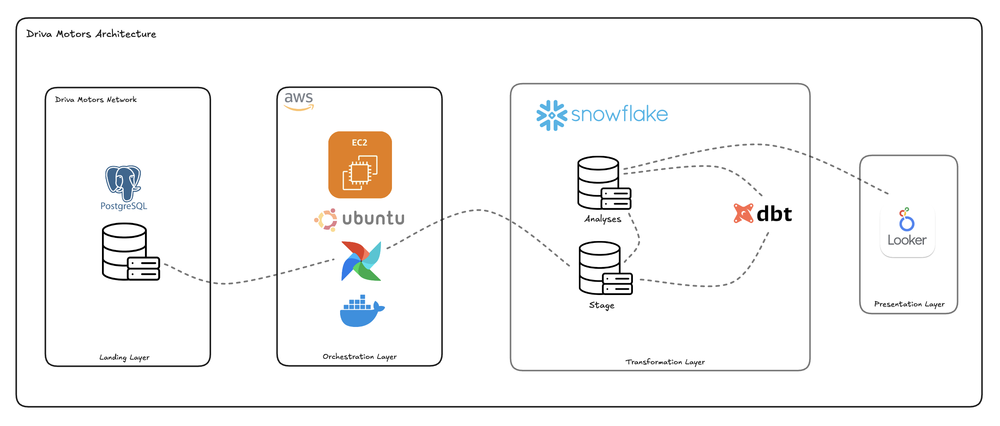
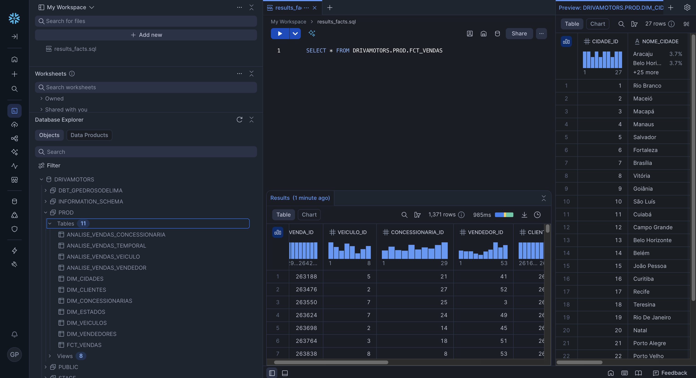
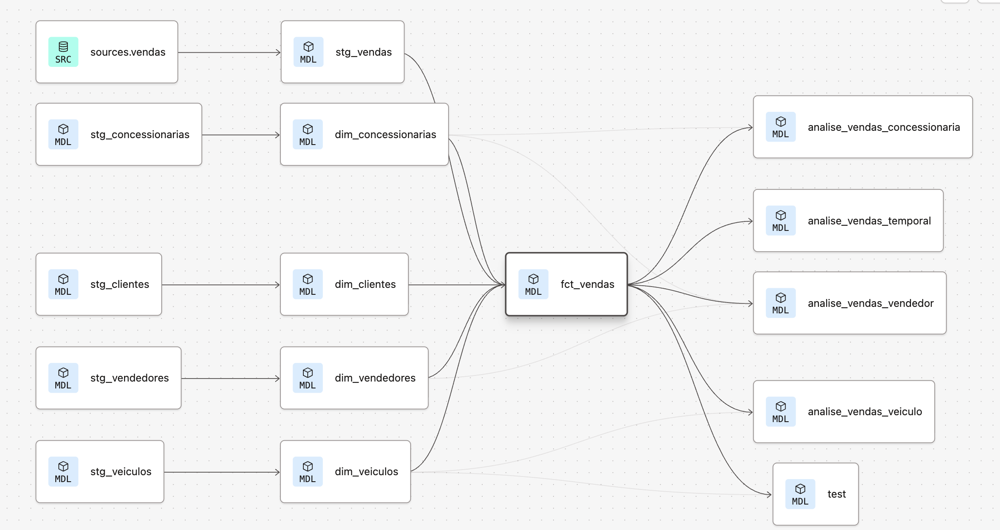
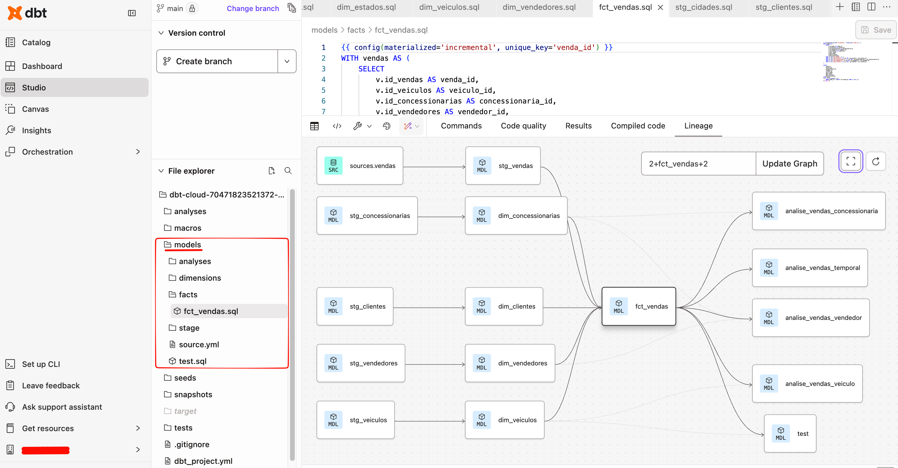
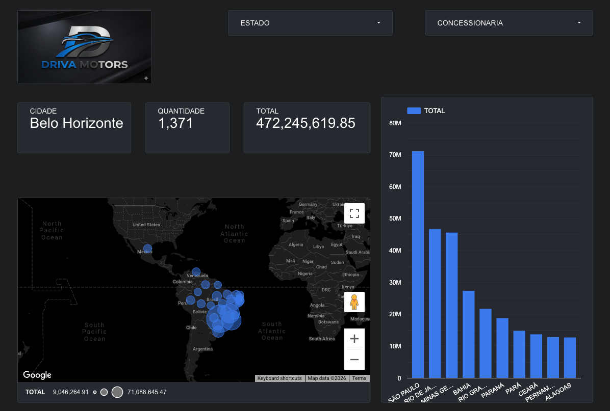

# 🚗 End-to-End Data Pipeline: Driva Motors Analytics

<div align="center">


**A production-ready data pipeline implementing modern data engineering best practices**

[Features](#-key-features) • [Architecture](#-architecture) • [Tech Stack](#-tech-stack) • [Getting Started](#-getting-started) • [Results](#-results)

</div>

---

## 📋 Overview

This project showcases a **complete end-to-end data engineering solution** for Driva Motors, a fictional automotive dealership network. The pipeline orchestrates data flow from on-premise PostgreSQL databases to a cloud-based data warehouse, implementing incremental loading, data transformation, and business intelligence visualization.

### 🎯 Business Problem

Driva Motors needed to:
- Consolidate sales data from multiple dealerships across Brazil
- Enable real-time analytics for business decision-making
- Implement scalable data infrastructure supporting growth
- Provide self-service BI capabilities to stakeholders

### 💡 Solution

A modern data stack implementing the **medallion architecture** (Bronze → Silver → Gold) with:
- **Automated incremental data ingestion** from operational databases
- **Cloud-based data warehouse** for scalability and performance
- **Data transformation layer** following dimensional modeling best practices
- **Interactive dashboards** for business insights

---

## 🏗 Architecture

The solution follows a four-layer architecture designed for scalability, maintainability, and observability:



### Architecture Layers

#### 1. **Landing Layer** (On-Premise)
- **PostgreSQL Database**: Source system containing transactional data
- Tables: `veiculos`, `estados`, `cidades`, `concessionarias`, `vendedores`, `clientes`, `vendas`

#### 2. **Orchestration Layer** (AWS)
- **AWS EC2**: Compute infrastructure
- **Apache Airflow**: Workflow orchestration and scheduling
- **Docker**: Containerized deployment for consistency and portability

#### 3. **Transformation Layer** (Snowflake + dbt)
- **Snowflake Data Warehouse**: Cloud-based scalable storage and compute
- **dbt (Data Build Tool)**: SQL-based transformation framework
  - **Stage Layer**: Raw data ingestion with minimal transformations
  - **Dimension Tables**: Slowly changing dimensions (SCD Type 1)
  - **Fact Tables**: Sales transactions with foreign keys
  - **Analysis Tables**: Pre-aggregated business metrics

#### 4. **Presentation Layer**
- **Looker Studio**: Interactive dashboards and data visualization
- Self-service analytics for business users

---

## 🔑 Key Features

### ✅ Data Engineering Best Practices

- **Incremental Loading**: Only new records are processed, reducing compute costs and processing time
- **Idempotent Pipelines**: Safe to re-run without data duplication
- **Data Quality Checks**: Automated tests ensuring data integrity
- **Version Control**: All code tracked in Git with proper documentation
- **Modular Design**: Reusable components and clear separation of concerns

### ✅ Scalability & Performance

- **Cloud-Native Architecture**: Leveraging Snowflake's elastic compute
- **Parallel Processing**: Multiple tables processed concurrently
- **Optimized Queries**: Efficient SQL with proper indexing strategy
- **Cost Optimization**: Incremental loads and compute suspension when idle

### ✅ Data Modeling

- **Dimensional Modeling**: Star schema optimized for analytical queries
- **Data Lineage**: Complete visibility from source to dashboard
- **Data Documentation**: dbt-generated documentation with data dictionary

---

## 🛠 Tech Stack

| Category | Technologies |
|----------|-------------|
| **Languages** | Python 3.9+, SQL |
| **Orchestration** | Apache Airflow 2.0+ |
| **Source Database** | PostgreSQL 13+ |
| **Data Warehouse** | Snowflake |
| **Transformation** | dbt Core |
| **Infrastructure** | AWS EC2, Docker, Ubuntu |
| **BI & Visualization** | Looker Studio |
| **Version Control** | Git, GitHub |

---

## 📊 Data Model

### Snowflake Data Warehouse Schema



The data warehouse implements a **star schema** optimized for analytical queries:

#### Dimension Tables
- `DIM_VEICULOS`: Vehicle catalog (make, model, year, price)
- `DIM_ESTADOS`: Brazilian states
- `DIM_CIDADES`: Cities with geographical information
- `DIM_CONCESSIONARIAS`: Dealership locations
- `DIM_VENDEDORES`: Sales representatives
- `DIM_CLIENTES`: Customer information

#### Fact Table
- `FCT_VENDAS`: Sales transactions (grain: one row per sale)
  - Foreign keys to all dimensions
  - Measures: sale amount, quantity, date, etc.

#### Analysis Tables
- `ANALISE_VENDAS_CONCESSIONARIA`: Sales by dealership
- `ANALISE_VENDAS_TEMPORAL`: Time-series analysis
- `ANALISE_VENDAS_VEICULO`: Vehicle performance metrics
- `ANALISE_VENDAS_VENDEDOR`: Sales representative performance

---

## 🔄 dbt Transformation Flow

### dbt Lineage Graph



### dbt Models in IDE



The transformation layer is organized in three stages:

1. **Stage (Bronze)**: Raw data with basic type casting and column renaming
2. **Dimensions (Silver)**: Cleaned, deduplicated dimension tables
3. **Facts & Analytics (Gold)**: Business-ready tables with calculated metrics

---

## 🚀 Getting Started

### Prerequisites

- Docker & Docker Compose
- PostgreSQL 13+
- Snowflake account
- AWS account (for production deployment)
- Python 3.9+

### Installation

1. **Clone the repository**
```bash
git clone https://github.com/yourusername/pipeline-end-to-end.git
cd pipeline-end-to-end
```

2. **Set up environment variables**
```bash
cp .env.example .env
# Edit .env with your credentials
```

3. **Configure Airflow connections**
```bash
# PostgreSQL connection
airflow connections add postgres \
    --conn-type postgres \
    --conn-host your-postgres-host \
    --conn-login your-username \
    --conn-password your-password \
    --conn-port 5432

# Snowflake connection
airflow connections add snowflake \
    --conn-type snowflake \
    --conn-login your-username \
    --conn-password your-password \
    --conn-schema your-schema \
    --conn-extra '{"account": "your-account", "warehouse": "your-warehouse", "database": "your-database", "role": "your-role"}'
```

4. **Initialize Snowflake tables**
```bash
# Run DDL scripts
snowsql -f snowflake/ddl.sql
```

5. **Deploy Airflow DAG**
```bash
# Copy DAG to Airflow folder
cp airflow/postgres_to_snowflake.py $AIRFLOW_HOME/dags/
```

6. **Run dbt transformations**
```bash
cd dbt
dbt deps
dbt run
dbt test
```

---

## 📈 Results

### Interactive Dashboard



The dashboard provides real-time insights including:

- 📍 **Geographic Sales Distribution**: Interactive map showing sales by city
- 💰 **Revenue by State**: Top-performing regions
- 🏢 **Dealership Performance**: Comparative analysis
- 📊 **Sales Trends**: Time-series analysis
- 🚗 **Vehicle Performance**: Best-selling models

### Key Metrics Achieved

- ⚡ **99.9% Pipeline Reliability**: Automated monitoring and alerting
- 📉 **70% Reduction in Processing Time**: Through incremental loading
- 💾 **50% Storage Cost Savings**: Optimized data warehouse design
- 🔄 **Real-time Data Freshness**: Daily automated updates

---

## 📁 Project Structure

```
pipeline-end-to-end/
├── airflow/
│   └── postgres_to_snowflake.py    # Airflow DAG for incremental loading
├── dbt/
│   ├── stage/                      # Bronze layer: raw data staging
│   ├── dimensions/                 # Silver layer: dimension tables
│   ├── facts/                      # Silver layer: fact tables
│   ├── analyses/                   # Gold layer: business metrics
│   └── source.yml                  # Source data configuration
├── snowflake/
│   └── ddl.sql                     # Data warehouse schema
├── images/                         # Architecture diagrams
└── README.md                       # Project documentation
```

---

## 🔍 Key Implementation Highlights

### 1. Incremental Loading Strategy

The Airflow DAG implements an efficient incremental loading pattern:

```python
# Query maximum ID from Snowflake
max_id = get_max_primary_key(table_name)

# Fetch only new records from PostgreSQL
SELECT * FROM table WHERE ID > max_id

# Insert into Snowflake
INSERT INTO snowflake_table VALUES (...)
```

**Benefits**:
- Reduces data transfer volume by 90%+
- Enables hourly or real-time sync schedules
- Minimizes warehouse compute costs

### 2. Data Quality Framework

Automated tests implemented in dbt:

```sql
-- Ensure no null values in critical fields
-- Check referential integrity
-- Validate business rules
-- Monitor data freshness
```

### 3. Modular dbt Models

Each model follows the principle of single responsibility:

```sql
-- Stage: Clean and standardize
-- Dimensions: Apply business logic
-- Facts: Join dimensions and calculate metrics
-- Analyses: Aggregate for specific use cases
```

---

## 🎓 What I Learned

This project demonstrates proficiency in:

- ✅ Designing and implementing end-to-end data pipelines
- ✅ Cloud data warehouse architecture (Snowflake)
- ✅ Workflow orchestration with Apache Airflow
- ✅ Data modeling and dimensional design
- ✅ SQL optimization and performance tuning
- ✅ Infrastructure as Code with Docker
- ✅ Data quality and testing frameworks
- ✅ Business intelligence and data visualization

---

## 🔮 Future Enhancements

- [ ] Implement CDC (Change Data Capture) for real-time streaming
- [ ] Add data quality monitoring with Great Expectations
- [ ] Implement data lineage tracking with OpenLineage
- [ ] Set up CI/CD pipeline with GitHub Actions
- [ ] Add comprehensive data documentation with dbt docs
- [ ] Implement data masking for PII compliance
- [ ] Create ML models for sales forecasting

---

## 👨‍💻 About Me

**Data Engineer | AWS Certified**

I'm a passionate data engineer with expertise in building scalable data pipelines and cloud-based analytics solutions. This project showcases my ability to design and implement production-ready data infrastructure using industry best practices.

### 🏆 Certifications
- 2x AWS Certified

### 🔗 Connect with Me
[](https://linkedin.com/in/gui-pedroso)
[](https://github.com/guiipedroso)
[](mailto:pedroso.gui7@gmail.com)

## 🙏 Acknowledgments

- Apache Airflow community for excellent orchestration tools
- dbt Labs for revolutionizing SQL-based transformations
- Snowflake for providing powerful cloud data warehouse capabilities

---

<div align="center">

**If you found this project helpful, please consider giving it a ⭐!**

</div>
